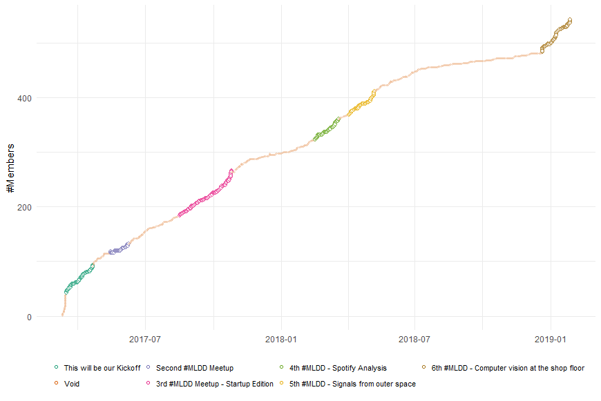
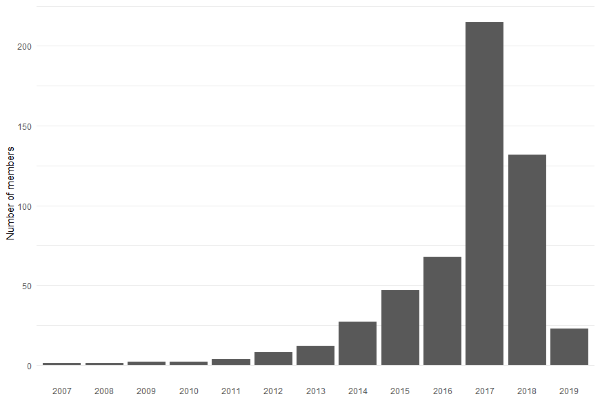
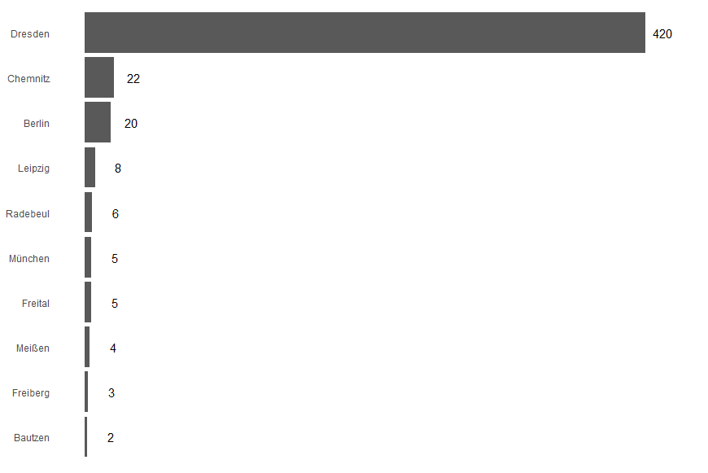
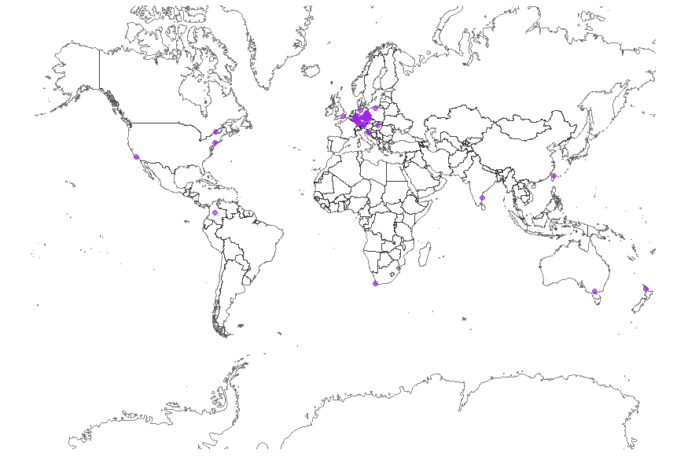
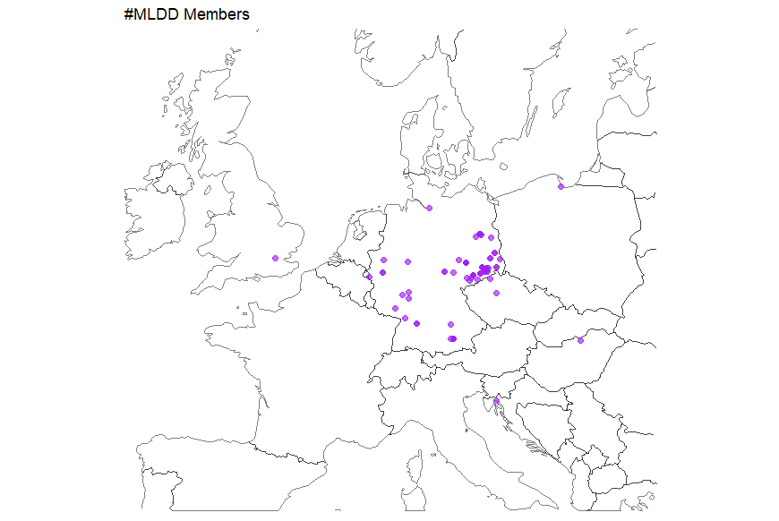

# muin - **M**eet**U**p **I**n **N**umbers
This is a just-for-fun side project to create some nice reports for meetups. It would be really nice to see what plots other meetups would produce!

In order to get the data I am using [meetupr](https://github.com/rladies/meetupr). Follow the install instructions on their page.

## Noteworthy things in the script
The central R script in this project is mostly a practical exercise of basic R plotting and a little data wrangling. I believe there may be two things that are a bit harder to comprehend.

First, **meetupr** does not parse all the fields in the response into a dataframe. Luckily, however, it puts everything needed into an additional column, called _resource_. This is a list and we need to get some data out of it (e.g., for plotting the growth of a meetup). This is done using ```ldply```.

Second, the event data is a different dataframe than the member data.

**Member data:**

| date | member-count |
| --- | --- |
| 2018-01-01 | 1 |
| ... | ... |
| 2018-02-01 | 10 |

**Event data:**

| date | event-name |
| --- | --- |
| 2018-02-01 | Our first meetup |

In order to plot them nicely with ```ggplot``` it is useful to have everything in a single dataframe of the form:

| date | member-count | meetup-name |
| --- | --- | --- |
| 2018-01-01 | 1 | void |
| ... | ... | void |
| 2018-02-01 | 10 | Our first meetup |

However, joining timeseries is a bit harder than trivial: We don't have a member-count for each day a meetup existed (there are only rows for dates where new members joined) and thus, joining the two timeseries by date won't work. Luckily ```tidyverse``` has two neat functions: ```complete``` which completes missing rows in a column with a given sequence and ```fill``` which fills ```NA``` values with the previous row's value. Here is the full code:
```R
#### Member growth over time ####
# for each meetup, take the time it was announced (x$created) and the time it happened (x$time) and
# put them in two seperate rows with the same name
# finally, add a third row, one day later, with the name "void" which marks the time period between two meetups
# then, use "complete" to fill the gaps in the date-column. the new rows will have "NA" in the name column.
# the latter is mitigated with fill
df_ev <- ldply(events$resource, function(x) data.frame(name = c(x$name, x$name, "Void"), ts = c(x$created/1000, x$time/1000, (x$time/1000 + 24)))) %>%
         mutate(ts = as_date(as_datetime(ts))) %>%
         complete(ts = seq.Date(from = min(ts), to = max(ts), by = "day")) %>%
         fill(name)

# create dataframe from lost similar to the one above
# since every new member is it's own row (id is the member's meetup.com id), the row_count is the total count of members.
# the use the same trick with complete and fill to add the missing dates
df <- ldply(members$resource, function(x) data.frame(id = x$id, ts = x$group_profile$created/1000)) %>%
      mutate(cnt = row_number(ts)) %>%
      mutate(ts = as_date(as_datetime(ts))) %>%
      complete(ts = seq.Date(from = min(ts), to = max(ts), by = "day")) %>%
      arrange(ts) %>%
      fill(id, cnt)

# now we have two dataframes with the dt column filled for every day since the start of the meetup
# join the members dataframe with the events dataframe on the date column
df <- left_join(df, df_ev, by = c("ts"))
# you'll need that if people joined your meetup before the first event was scheduled
df[is.na(df$name), ]$name <- "Void"
```

## Example Plots for Machine Learning Dresden (MLDD)
Here are all the plots, generated with [muin.R](muin.R) for a meetup that I am co-organizing: [MLDD](https://www.meetup.com/MLDD-Machine-Learning-Dresden/).

### Growth
This plot shows the number of members over time. Small points correspond to dates where no meetup was announced (hence, the name "void"). Contrary, the bigger points have a different color for each meetup and start with the announcement of the meetup and with the meetup actually taking place. 


### Population Structure
This plot groups all members by the year they joined meetup.com.


### Top 10 Cities
There is also a list of the top 3 countries in [muin.R](muin.R) but since meetups are supposed to be local, this is rather boring.

Plotting the top 10 cities is more interesting: It is not uncommon for people in Saxony (the [Bundesland](https://en.wikipedia.org/wiki/L%C3%A4nder) Dresden is located in) to drive here for our meetups. For example, Chemnitz is about 50 miles away. Berlin is even farther.


### Worldmap of members
Meetups API even delivers GPS coordinates of the members. If we have that, there is no holding back in plotting that on a world map. Of course, always take location data with a grain of salt: It is hardly ever accurate.


Even though, we seem to have some members outside of Europe this could be due to to members not updating their profile information or the use of Tor networks - just to name two possibilities. So zooming in on Europe gives this.

