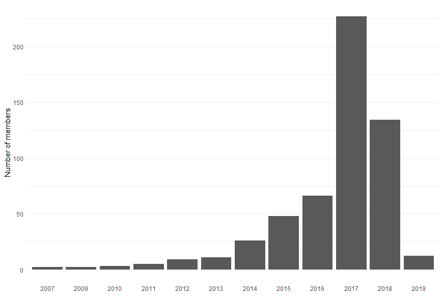

# muin - MeetUp In Numbers
This is a fun project to create some nice reports for meetups.

## Example Plots for Machine Learning Dresden (MLDD)
Here are all the plots, generated with [muin.R](muin.R) for a meetup that I am co-organizing: [MLDD](https://www.meetup.com/MLDD-Machine-Learning-Dresden/).
### Growth
This plot shows the number of members over time. Small points correspond to dates where no meetup was announced (hence, the name "void"). Contrary, the bigger points have a different color for each meetup and start with the announcement of the meetup and with the meetup actually taking place. 

The red line is a linear model of the growth (just because we can).

### Population Structure
This plot groups all members by the year they joined meetup.com.

### Top 10 Cities
There is also a list of the top 3 countries in [muin.R](muin.R) but since meetups are supposed to be local, this is rather boring.

Plotting the top 10 cities is more interesting: It is not uncommon for people in Saxony (the [Bundesland](https://en.wikipedia.org/wiki/L%C3%A4nder) Dresden is located in) to drive here for our meetups. For example, Chemnitz is about 50 miles away. Berlin is even farther.

### Worldmap of members
Meetups API even delivers GPS coordinates of the members. If we have that, there is no holding back in plotting that on a world map. Of course, always take location data with a grain of salt: It is hardly ever accurate.

Even though, we seem to have some members outside of Europe this could be due to to members not updating their profile information or the use of Tor networks - just to name two possibilities. So zooming in on Europe gives this.

