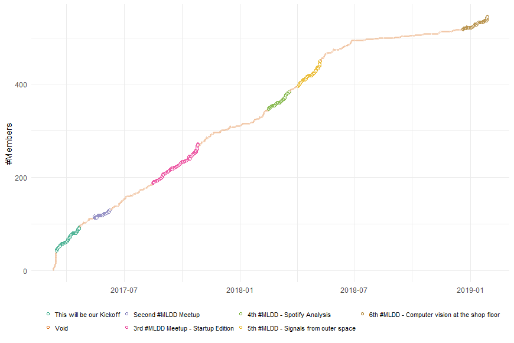
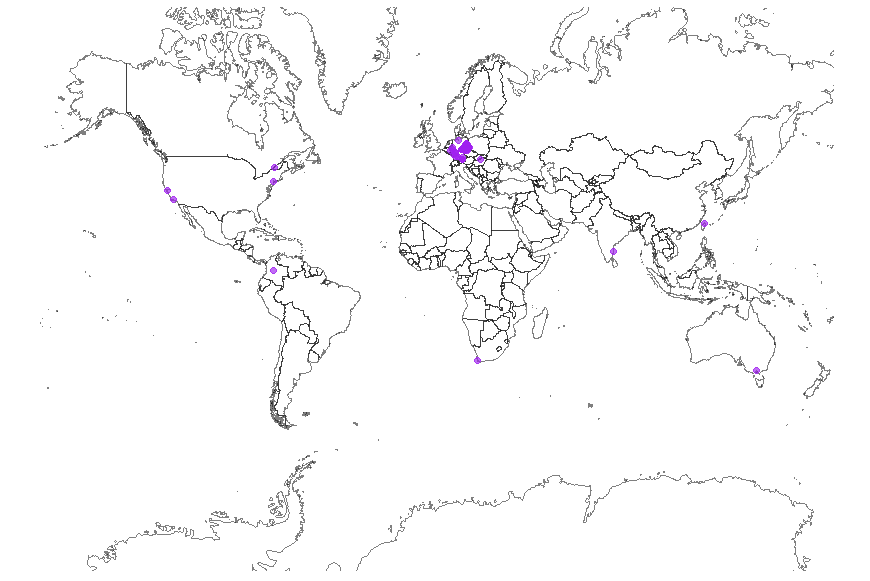
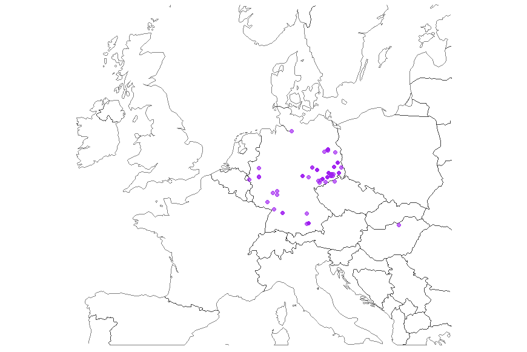

# muin - **M**eet**U**p **I**n **N**umbers

This is a just-for-fun side project to create some nice reports for meetups.
It would be really nice to see what plots other meetups produce!

For connecting to meetup.com's API I am using [meetupr](https://github.com/rladies/meetupr).
Follow the install instructions on their page.

## Noteworthy things in the script

The central R script in this project is mostly a practical exercise of basic R plotting and a little data wrangling.
There is, however, one tricky bit which I'd like mention: time-series.
I love the whole _tidyverse_ but I always found time-series to be a bit hard to deal with: _ggplot_ likes data-frames to contain the complete information (adding layers with different data is possible but doesn't work in all cases) and it wants the data-frames to be narrow and long (see the Overview [here](https://tidyr.tidyverse.org/)).
For that to happen we need to join time-series but you can only join what is equal: There is no notion of _happens between_ in the join semantics of _dplyr_ and _plyr_ (or I don't know it exists).
So long story short, we need to prepare our time-series a little bit.

But before we start with the time-series, we need to fix one minor annoyance: **meetupr** does not parse all the fields in the response into a data-frame.
Luckily, however, it puts everything needed into an additional column, called _resource_.
This is a list and we need to get some data out of it (e.g., for plotting the growth of a meetup).
This is done using ```ldply```.

Second, the event data is a different data-frame than the member data.

**Member data:**

| date | member-count |
| --- | --- |
| 2018-01-01 | 1 |
| ... | ... |
| 2018-02-01 | 10 |

**Event data:**

| date | event-name |
| --- | --- |
| 2018-02-01 | Our first meetup |

In order to plot them nicely with ```ggplot``` it is useful to have everything in a single data-frame of the form:

| date | member-count | meetup-name |
| --- | --- | --- |
| 2018-01-01 | 1 | void |
| ... | ... | void |
| 2018-02-01 | 10 | Our first meetup |

However, joining time-series is a bit harder than trivial: We don't have a member-count for each day a meetup existed (there are only rows for dates where new members joined) and thus, joining the two time-series by date won't work. Luckily ```tidyverse``` has two neat functions: ```complete``` which completes missing rows in a column with a given sequence and ```fill``` which fills ```NA``` values with the previous row's value.
Here is how it works in practice.

### Events data-frame

For each meetup, take the time it was announced ```x$created``` and the time it happened ```x$time``` and put them in two separate rows with the same name.
Finally, add a third row, one day later, with the name "void" which marks the time period between two meetups.
Then, use ```complete``` to fill the gaps in the date-column.
The new rows will have ```NA``` in the name column.
the latter is mitigated with ```fill```.

```R
df_ev <- ldply(events$resource,
               function(x) data.frame(name = c(x$name, x$name, "Void"),
                                      ts = c(x$created/1000, x$time/1000, (x$time/1000 + 24)))) %>%
         mutate(ts = as_date(as_datetime(ts))) %>%
         complete(ts = seq.Date(from = min(ts), to = max(ts), by = "day")) %>%
         fill(name)
```

### Members dataframe

The members data-frame works more or less like the events data-frame.
First, create data-frame from the _resource_ list similar to how it was done with the events.
Since every new member is it's own row (```id``` is the member's meetup.com id), the ```row_count``` is the total count of members.
Then use the same trick with ```complete``` and ```fill``` to add the missing dates.

```R
df <- ldply(members$resource,
            function(x) data.frame(id = x$id, ts = x$group_profile$created/1000)) %>%
      mutate(cnt = row_number(ts)) %>%
      mutate(ts = as_date(as_datetime(ts))) %>%
      complete(ts = seq.Date(from = min(ts), to = max(ts), by = "day")) %>%
      arrange(ts) %>%
      fill(id, cnt)
```

### Joining the two

Now we have two data-frames with their ```dt``` column filled for every day since the start of the meetup.
With that, it's now possible to join the members data-frame with the events data-frame on the dt column.
Finally, since we used the ```min``` and ```max``` of the events data-frame to complete the dt column, it might happen that the members data-frame contains dates _before_ the events data-frame.
In other words: People joined your meetup before you scheduled your first event.
That is why we need to replace those early dates name column with "Void" - our keyword for dates between scheduled events.

```R
df <- left_join(df, df_ev, by = c("ts"))
df[is.na(df$name), ]$name <- "Void"
```

## Example Plots for Machine Learning Dresden (MLDD)


Here are all the plots, generated with [muin.R](muin.R) for a meetup that I am co-organizing: [MLDD](https://www.meetup.com/MLDD-Machine-Learning-Dresden/).

### Growth

This plot shows the number of members over time. Small points correspond to dates where no meetup was announced (hence, the name "void").
Contrary, the bigger points have a different color for each meetup and start with the announcement of the meetup and end with the meetup actually taking place.


### Population Structure

This plot groups all members by the year they joined meetup.com.


### Top 10 Cities

There is also a list of the top 3 countries in [muin.R](muin.R) but since meetups are supposed to be local, this is rather boring.

Plotting the top 10 cities is more interesting: It is not uncommon for people in Saxony (the [Bundesland](https://en.wikipedia.org/wiki/L%C3%A4nder) Dresden is located in) to drive here for our meetups.
For example, Chemnitz is about 50 miles away.
Berlin is even farther - but I guess these are people who are in Dresden occasionally and like to visit a meetup when they are here once in a while.


### Worldmap of members

Meetups API even delivers GPS coordinates of the members.
If we have that, there is no holding back in plotting that on a world map.
Of course, always take location data with a grain of salt: It is hardly ever accurate.


Even though, we seem to have some members outside of Europe this could be due to to members not updating their profile information or the use of Tor networks - just to name two possibilities.
So zooming in on Europe gives this.

